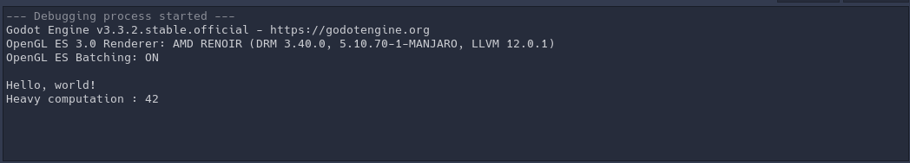
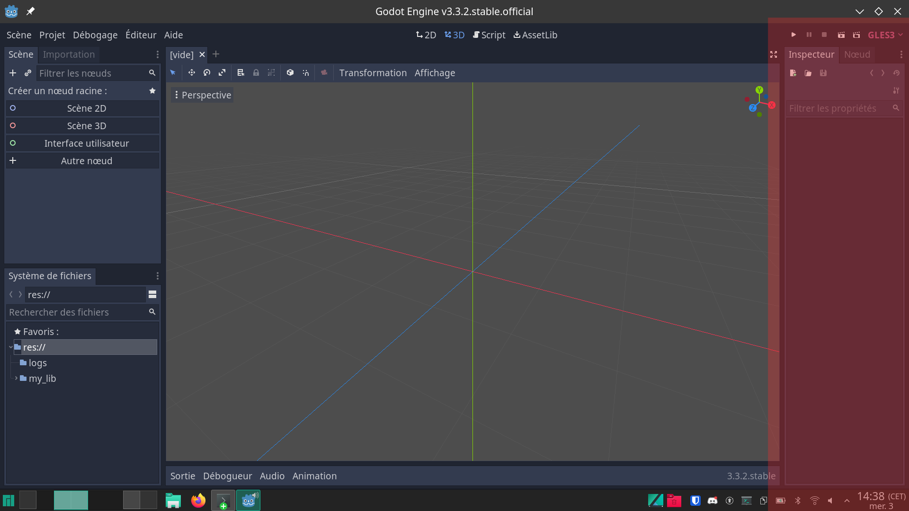
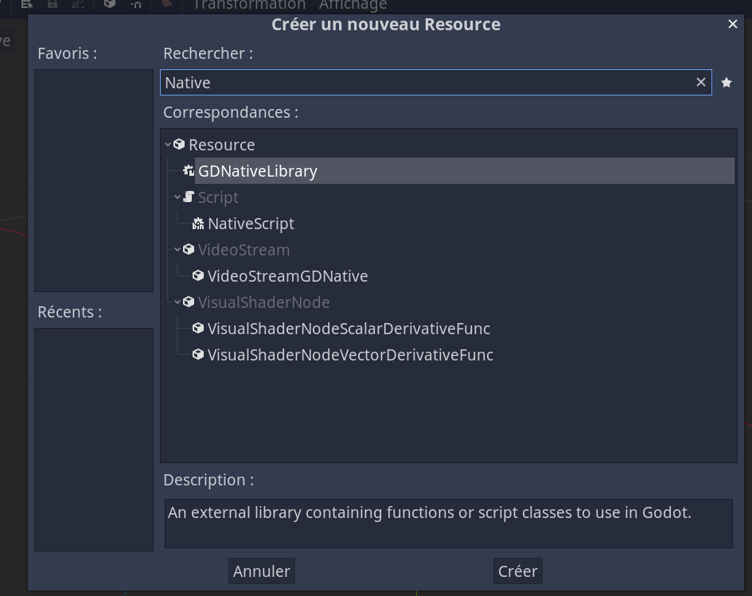
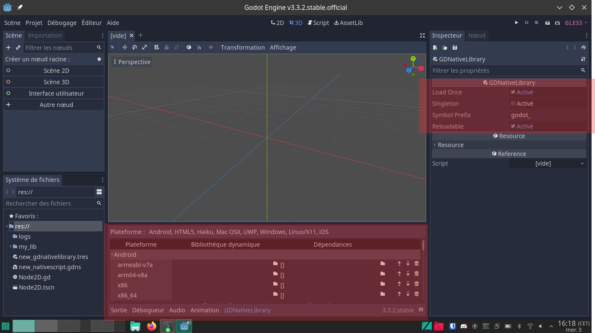
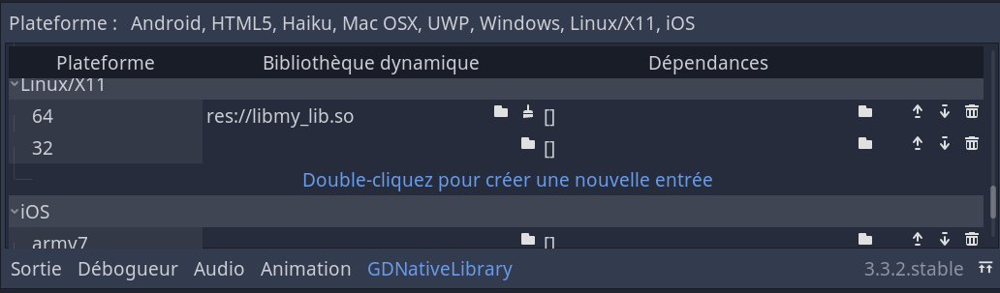
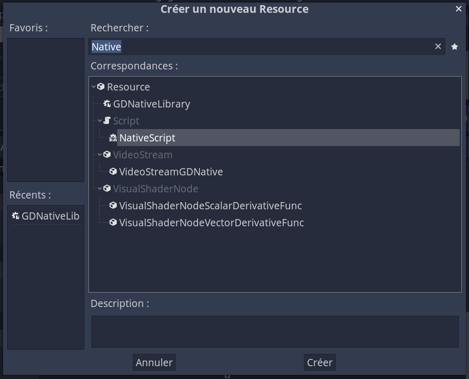
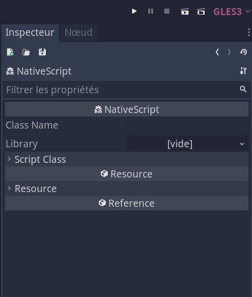
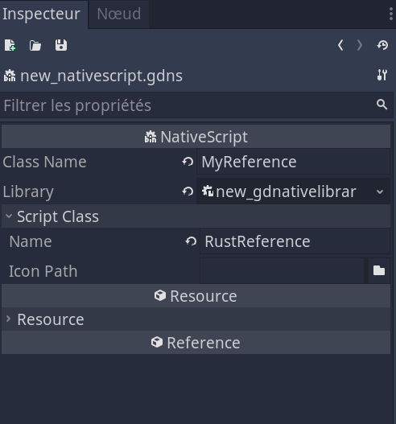

# Tutorial

The goal of this tutorial is to help you setup a godot project so you have a NativeClass made in rust and you can use it from gdscript like this :

```gdscript
extends Node2D

func _ready():
	# Our class made in rust, youhou!
	var ref  = RustReference.new()
	ref.hello_world()
	print("Heavy computation : ", ref.heavy_computation())
```

to output something like this:



It wont get into details covered in other part of the book. <!-- And if it does, its a mistake, be kind enough to correct me ;) -->

I'll do this on Godot Engine v3.3.2.stable.official, on my linux laptop but it works similarly for windows on mac.

## Make a godot project

Open the godot editor and create a new project in a folder we'll call new_project_folder.

your file tree should look like this :

```
new_project_folder/
└── project.godot
```

## Create a new cargo library

You go into the terminal and run the command `cargo new --lib my_lib` which creates the following files :

```
my_lib/
├── Cargo.toml
└── src
    └── lib.rs
```

### We setup the Cargo.toml as has been showed in other tutorials.

my_lib/Cargo.toml 
```toml

[package]
name = "my_lib"
version = "0.1.0"
edition = "2021"

[lib]
crate-type = ["cdylib"]

[dependencies]
gdnative = "0.9.3"
```

### We setup the lib.rs as follows.


We'll want to inherent a Reference so we'll make a structure that looks like this:

```rust
#[derive(NativeClass)]
#[inherit(Reference)]
pub struct MyReference {}
```

We'll implement the method new and the two other methods used in our example, here's the full code :

```rust
use gdnative::prelude::*;

#[derive(NativeClass)]
#[inherit(Reference)]
pub struct MyReference {}

#[methods]
impl MyReference {
    // This is required in order to inherit reference.
    pub fn new(_owner: &Reference) -> Self {
        MyReference {}
    }

    // The most simple example, covered elsewhere.
    #[export]
    pub fn hello_world(&self, _owner: &Reference) {
        godot_print!("Hello, world!");
    }

    // This could be implemented how you want, and after
    // heavy calculations
    // done in rust would return a very meaningful float.
    #[export]
    pub fn heavy_computation(&self, _owner: &Reference) -> f64 {
        42.0
    }
}

fn init(handle: gdnative::prelude::InitHandle) {
    handle.add_class::<MyReference>();
}

godot_gdnative_init!();
godot_nativescript_init!(init);
godot_gdnative_terminate!();
```

### We build the binary.

To do so we'll have to run :`cargo build --release` in the folder of our library and since we have `crate-type = ["cdylib"]` in our Cargo.toml, we'll have a `libmy_lib.so` binary that is compatible with godot here :

```
new_project_folder/
├── my_lib
│   ├── Cargo.lock
│   ├── Cargo.toml
│   ├── src
│   │   └── lib.rs
│   └── target
│       └── release
│           ├── libmy_lib.d
│           └── libmy_lib.so <--- here
└── project.godot
```

In order to simplify accessing it from godot we'll copy it here:

```
new_project_folder/
├── libmy_lib.so <--- copy it here
├── my_lib
│   ├── Cargo.lock
│   ├── Cargo.toml
│   ├── src
│   │   └── lib.rs
│   └── target
│       └── release
│           ├── libmy_lib.d
│           └── libmy_lib.so
├── notes
└── project.godot
```

Now onto godot!

### Create the native library

The rust part is over, now you have to open the godot editor for your project and go into the inspector (in red)!




We'll have to create 2 Resource in godot, for this we need to click the new resource button in the inspector :


and search for GDNativeLibrary 



we see the editor update :



And we plug in our binary in linux X11 64 (and or other, out of scope for this tutorial):



Perfect! It's done, its just **really important** to save our file by hitting the save button:


and save with default name `new_gdnativelibrary.tres`.

### Create the native class

then we'll create a NativeScript :




The inspector will look like this:



We edit it like this :

The name that corresponds to our rust structure
- Class Name : MyReference 

- Library : --we select the library we have created just before--

- Script class name : --the name of the class for godot and that we'll have to use from gdscript, here we choose RustReference-- 



then again we'll save (with the name : `new_nativescript.gdns`


that's it!

### Use it from gdscript

In order to use it from gdscript, we'll create a node, assign a script to it and make it look like this

```gdscript
extends Node2D

func _ready():
	# Our class made in rust, youhou!
	var ref  = RustReference.new()
	ref.hello_world()
	print("Heavy computation : ", ref.heavy_computation())

```

**If it's not working, you may have a problem with your `new_gdnativelibrary.tres` or your `new_nativescript.gdns`. Just suppress both files and remake them, then close and reopen the engine.**

<!-- From what I tested it's possible to have a correct set up but if you went through an incorrect one, things will still not work, it is fix like said just before. -->

your file tree should look like this :
```
new_project_folder/
├── libmy_lib.so
├── logs
│   ├── /* 
│   ├──     omitted
│   ├──             */
│   └── godot.log
├── my_lib
│   ├── Cargo.lock
│   ├── Cargo.toml
│   ├── src
│   │   └── lib.rs
│   └── target
│       └── release
│           ├── libmy_lib.d
│           └── libmy_lib.so
├── new_gdnativelibrary.tres
├── new_nativescript.gdns
├── Node2D.gd
├── Node2D.tscn
└── project.godot
```


If you followed along and got it working, good job!